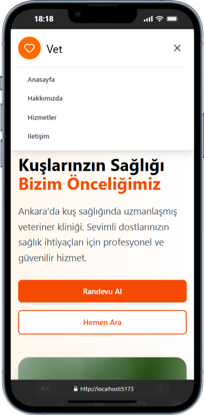
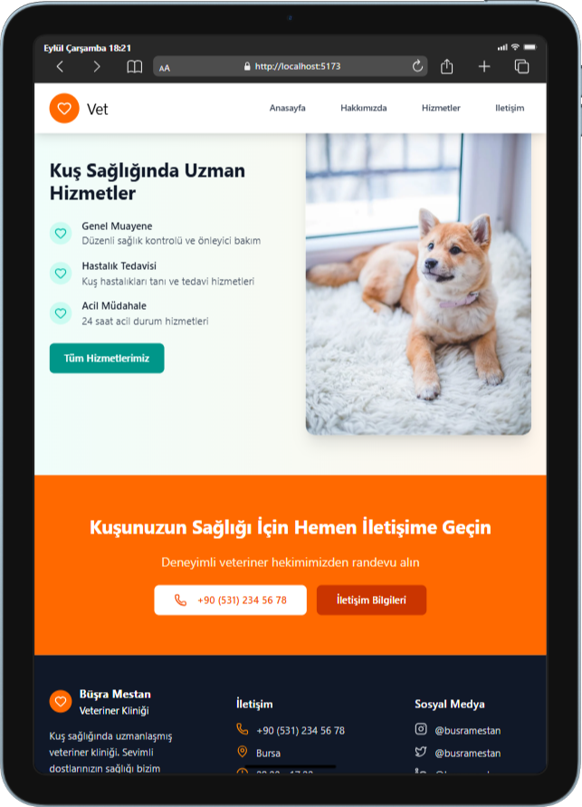
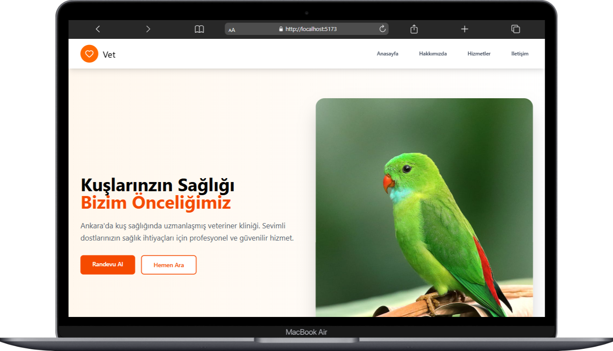

# Vet Klinik Projesi

Bu proje, tüm cihazlarda uyumlu çalışan, modern bir veteriner klinik web sitesidir. React ve TailwindCSS kullanılarak geliştirilmiştir. Kullanıcı dostu arayüzü sayesinde hem masaüstü hem de mobil cihazlarda sorunsuz bir deneyim sunar.

## Özellikler

- Mobil ve masaüstü uyumlu tasarım
- Hızlı ve modern kullanıcı arayüzü
- Kolayca özelleştirilebilir yapı
- React ve TailwindCSS ile geliştirilmiş

## Ekran Görüntüleri

### Masaüstü Görünümü


### Tablet Görünümü


### Mobil Görünümü


## Kurulum

1. Depoyu klonlayın:
   ```sh
   git clone https://github.com/busramestan/vet-app.git
   cd vet-app
   ```

2. Bağımlılıkları yükleyin:
   ```sh
   npm install
   ```

3. Projeyi başlatın:
   ```sh
   npm run dev
   ```
